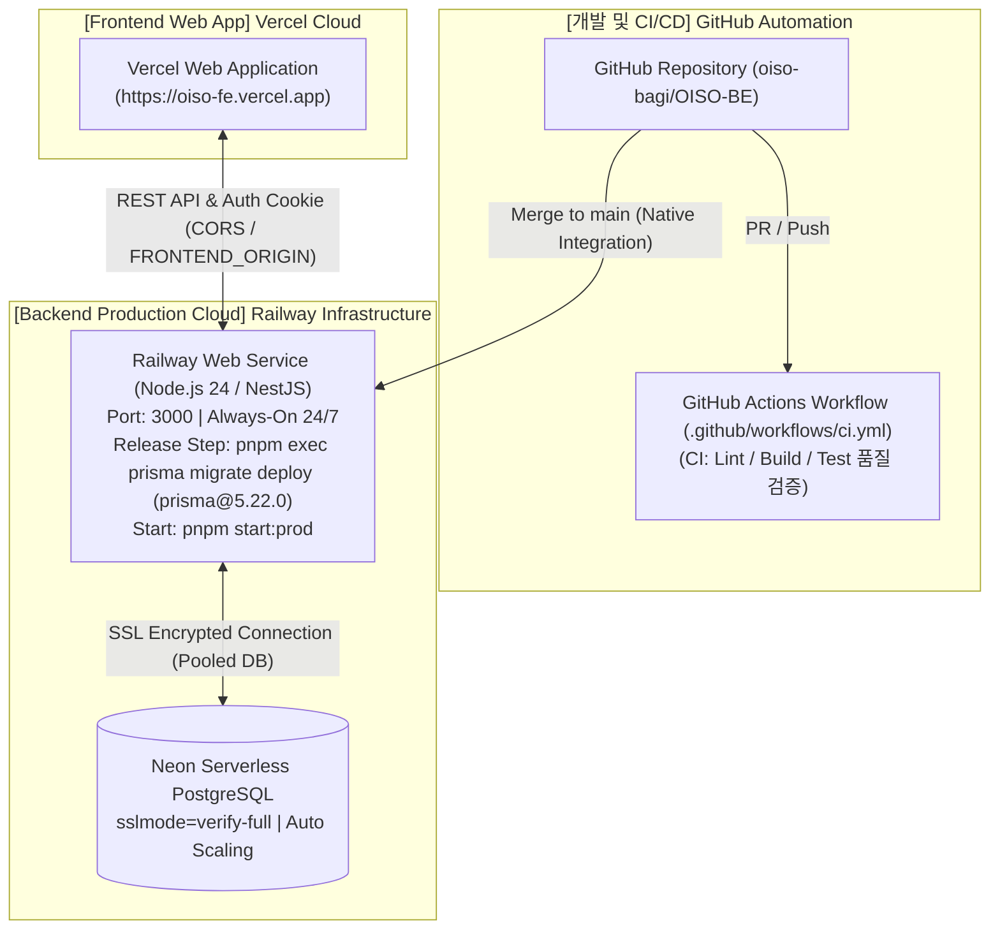

# ☁️ OISO-BE 클라우드 인프라 및 CI/CD 아키텍처 명세서

> **2026 관광데이터 공모전 (OISO-BE)**  
> **핵심 사양:** Neon Serverless PostgreSQL ➡️ Railway Web Service (Always-on) ➡️ GitHub Actions CI/CD 파이프라인 ➡️ 24/7 자동화 모니터링

---

## 1. Infrastructure Topology Overview (전체 인프라 토폴로지 개요)

본 시스템은 **높은 DB 가용성 확보**, **24/7 상시 서비스 유지를 통한 새벽 04:00 혼잡도 Cron 배치(`RouteCongestionCronService`) 실행 지원 (멱등성 실행, 자동 재시도, 미실행 건 복구 및 실패 알림 적용)**, 및 **코드 푸시 시 100% 자동화된 빌드/테스트/배포 파이프라인**을 목표로 구축되었습니다.

---

## 2. Database Architecture (Neon Serverless PostgreSQL)

### 2.1 DB 프로비저닝 사양
- **Provider**: Neon (Serverless PostgreSQL 15+)
- **연결 방식**: Prisma ORM 5.22+
  - `DATABASE_URL`: Transaction Connection Pooling 주소 (pgBouncer 기반 런타임 쿼리용)
  - `DIRECT_URL`: Direct Connection 주소 (`npx prisma migrate deploy` DDL 마이그레이션 전용)
  - `schema.prisma` 설정: `url = env("DATABASE_URL")`, `directUrl = env("DIRECT_URL")`
- **보안 설정**: TLS/SSL 필수 검증 연결 (`sslmode=verify-full`, 신뢰할 수 있는 CA 인증서 및 호스트네임 검증 설정)
- **백업 및 복구**: Neon Point-in-time Restore (PITR) 자동 활성화

### 2.2 Prisma Schema & Migration 관리

- 개발 환경 스키마 변경 시 `npx prisma migrate dev`로 마이그레이션 SQL 파일 생성
- CI/CD 배포 파이프라인에서 사전 마이그레이션 SQL 리뷰, 스테이징 검증, PITR 복구 대책, Expand-Contract 모델 호환성 조건이 충족되었을 때 `npx prisma migrate deploy`를 통해 데이터 손실 없는 마이그레이션을 안전하게 전개 (`DIRECT_URL` 경유)

---

## 3. Application Server Architecture (Railway Web Service)

### 3.1 워커 배포 및 24/7 상시 가동 (Always-On)

- **Provider**: Railway Web Service
- **Runtime**: Node.js 24 LTS (pnpm package manager)
- **운영 정책**: 15분 비활성 시 잠드는 무료 서버의 한계를 극복하고, **24시간 스핀다운 없이 켜두는(Always-on) 정책**을 채택하여 매일 새벽 04:00 혼잡도 자동 갱신 Cron 배치(`RouteCongestionCronService`) 정시 실행을 지원합니다.

### 3.2 빌드 및 실행 명령어

- **Build Command**: `pnpm install --frozen-lockfile && pnpm run build` *(단독 실행 시 package.json의 `pnpm run build`가 `prisma:generate` 후 `build:raw`를 수행하며, CI 파이프라인에서는 `prisma:generate` 독립 스텝 후 `build:raw`를 실행하여 중복 생성을 회피)*
- **Release / Pre-deploy Command**: `pnpm exec prisma migrate deploy` *(lockfile에 고정된 `prisma@5.22.0` 버전으로 독립 마이그레이션 잡 또는 Release 스텝에서 선행 완료)*
- **Start Command**: `pnpm start:prod` (마이그레이션 정상 통과 후 백엔드 런타임 독립 론칭)

---

## 4. CI/CD Automation Pipeline (GitHub Actions & Railway Integration)

### 4.1 워크플로우 이벤트 트리거 (`.github/workflows/ci.yml`)

- `develop`, `main` 브랜치 대상 **Push** 또는 **Pull Request** 생성 시 자동 실행

### 4.2 역할 분담 및 브랜치 배포 수명주기 (Separation of Concerns & Branch Lifecycle)

- **GitHub Actions (CI)**: 실제 DB에 접속하지 않고 검증용 더미 URL(`DATABASE_URL`, `DIRECT_URL`)을 주입하여 `develop`, `main` 대상 Push/PR 시 코드 품질 검증(`lint`), 빌드(`build`), 유닛 테스트(`test`)를 100% 초고속 수행하며, 운영 DB Secrets는 CI 파이프라인에서 일체 사용하지 않음.
- **Railway Native Integration (CD)**:
  - **스테이징 개발 환경 (Staging Environment)**: `develop` 브랜치에 머지 시 독립된 Staging 서비스(독립 Staging DB 및 Secrets 적용)로 자동 배포되어, 프론트엔드 팀원의 실시간 **Swagger UI (`/api-docs`)** API 연동 및 QA 동시 수행.
  - **운영 상용 환경 (Production Environment)**: 프론트 연동 및 QA가 완료되면 `develop` ➡️ `main`으로 PR/Merge를 진행하여, 보호된 `main` 브랜치 기반의 Production 전용 서비스에 안전 배포.

### 4.3 CI 단계별 파이프라인

1. **Checkout & Node Setup**: Node.js 24 LTS 및 pnpm 설치 (pnpm store 캐시 적용)
2. **Prisma Schema Validation**: `pnpm run prisma:validate`
3. **Prisma Client Generation**: `pnpm run prisma:generate`
4. **Lint Verification**: `pnpm run lint` 코드 스타일 및 아키텍처 규칙 검증
5. **Git Diff Verification**: `git diff --exit-code` 린트 수행으로 인한 불필요한 소스 파일 자동 변경 방지 검증
6. **Production Build**: `pnpm run build:raw` 빌드 유효성 체크 (Prisma Client 선행 생성 후 중복 방지)
7. **Automated Unit Testing**: `pnpm run test` (Prisma Service Mocking 기반 순수 유닛 테스트만 수행)

---

## 5. Cross-Domain Interoperability & Security (Vercel ↔ Railway 연동 명세)

### 5.1 CORS (Cross-Origin Resource Sharing) 설정

- **허용 오리진 (Origin)**: `FRONTEND_ORIGIN` 환경변수에 기재된 도메인 (`https://oiso-fe.vercel.app`, `http://localhost:5173` 등 comma 구분을 통한 다중 허용 지원)
- **Credentials**: `credentials: true`로 설정하여 인증 쿠키 전송 허용

### 5.2 Cross-Site Auth Cookie 정책

- `AuthCookieService`를 통해 AccessToken / RefreshToken 쿠키 발급 시 기본적으로 `sameSite: 'lax'`, `secure: NODE_ENV === 'production'` 옵션이 적용됩니다.
- 서로 다른 클라우드 도메인(`vercel.app` ↔ `railway.app`) 간 크로스 도메인 인증 쿠키 전송이 필요한 경우 `COOKIE_SECURE=true`, `COOKIE_DOMAIN` 환경변수 지정을 통해 **`SameSite=None`**, **`Secure=true` (HTTPS 필수)**로 보안 설정을 확장/제어할 수 있습니다.

---

## 6. Environment Variables & Secrets Inventory (환경변수 인벤토리)

### 6.1 필수 시스템 환경변수 (`.env` / Railway Environment / GitHub Secrets)

| 변수명 | 설명 | 비고 |
|---|---|---|
| `NODE_ENV` | 실행 환경 (`production` / `development`) | 배포 시 `production` 고정 |
| `PORT` | NestJS 서버 웹 포트 | 기본값 `3000` (Railway 주입) |
| `DATABASE_URL` | Neon Postgres Pooled DB 연결 문자열 | `postgresql://...sslmode=verify-full` (pgBouncer 쿼리용) |
| `DIRECT_URL` | Neon Postgres Direct DB 연결 문자열 | `postgresql://...sslmode=verify-full` (DDL 마이그레이션 전용) |
| `FRONTEND_ORIGIN` | 프론트엔드 배포 및 개발 허용 오리진 | `https://oiso-fe.vercel.app` (CORS 및 쿠키 검증용, 쉼표 구분 가능) |
| `FRONTEND_AUTH_SUCCESS_REDIRECT` | 로그인 성공 후 이동할 프론트엔드 URL | 미지정 시 `FRONTEND_ORIGIN` 기본값 사용 |
| `FRONTEND_AUTH_CONSENT_REDIRECT` | 약관 동의 필요 시 이동할 프론트엔드 URL | 예: `https://oiso-fe.vercel.app/signup/terms` |
| `FRONTEND_AUTH_FAILURE_REDIRECT` | 로그인 실패 시 이동할 프론트엔드 URL | 예: `https://oiso-fe.vercel.app/login?error=auth_failed` |
| `JWT_ACCESS_SECRET` | AccessToken 서명 암호화 키 | 32자 이상 무작위 문자열 |
| `JWT_REFRESH_SECRET` | RefreshToken 서명 암호화 키 | 32자 이상 무작위 문자열 |
| `JWT_ACCESS_EXPIRES_IN` | AccessToken 유효 기간 | 기본값 `15m` |
| `JWT_REFRESH_EXPIRES_IN` | RefreshToken 유효 기간 | 기본값 `14d` |
| `COOKIE_SECURE` | 쿠키 Secure 옵션 명시 설정 | `true` / `false` (미지정 시 `production`일 때 `true`) |
| `COOKIE_DOMAIN` | 쿠키 공유 도메인 설정 | 예: `.vercel.app` (선택 사항) |
| `KAKAO_CLIENT_ID` | 카카오 소셜 로그인 REST API 키 | Kakao Developers |
| `KAKAO_CLIENT_SECRET` | 카카오 Client Secret | Kakao Developers |
| `KAKAO_REDIRECT_URI` | 카카오 OAuth 리다이렉트 URL | Railway 배포 도메인 + `/api/v1/auth/kakao/callback` |
| `KAKAO_AUTH_SCOPES` | 카카오 동의 항목 스코프 | 기본값 `account_email,profile_nickname` |
| `GOOGLE_CLIENT_ID` | 구글 OAuth Client ID | Google Cloud Console |
| `GOOGLE_CLIENT_SECRET` | 구글 OAuth Client Secret | Google Cloud Console |
| `GOOGLE_REDIRECT_URI` | 구글 OAuth 리다이렉트 URL | Railway 배포 도메인 + `/api/v1/auth/google/callback` |
| `GOOGLE_AUTH_SCOPES` | 구글 동의 항목 스코프 | 기본값 `openid email profile` |
| `VK_KORSERVICE2_API_KEY` | 한국관광공사 TourAPI 4.0 인코딩 키 | 공공데이터포털 (04:00 Cron 갱신용) |

---

## 7. Verification & Health Check Procedure (통합 검증 절차)

1. **서버 헬스체크**: 배포 후 `GET /` 엔드포인트에 200 OK 응답 확인
2. **소셜 로그인 리다이렉트**: `GET /api/v1/auth/kakao/login` 정상 리다이렉트 동작
3. **추천 루트 런타임 API**: `POST /api/v1/recommended-routes/recommend` 응답속도 < 100ms 검증
4. **배치 서비스 로깅 & 장애 복구 검증**: 새벽 04:00 Cron 갱신 성공 로그 수집 확인 및 **스테이징 환경 전용(Staging Only, 운영 데이터 무영향)**으로 강제 실패 시나리오, 재시도(Retry) 동작, 미실행 건 복구(Recovery), 실패 알림(Alert) 발송 수명주기 수동 검증 수행
