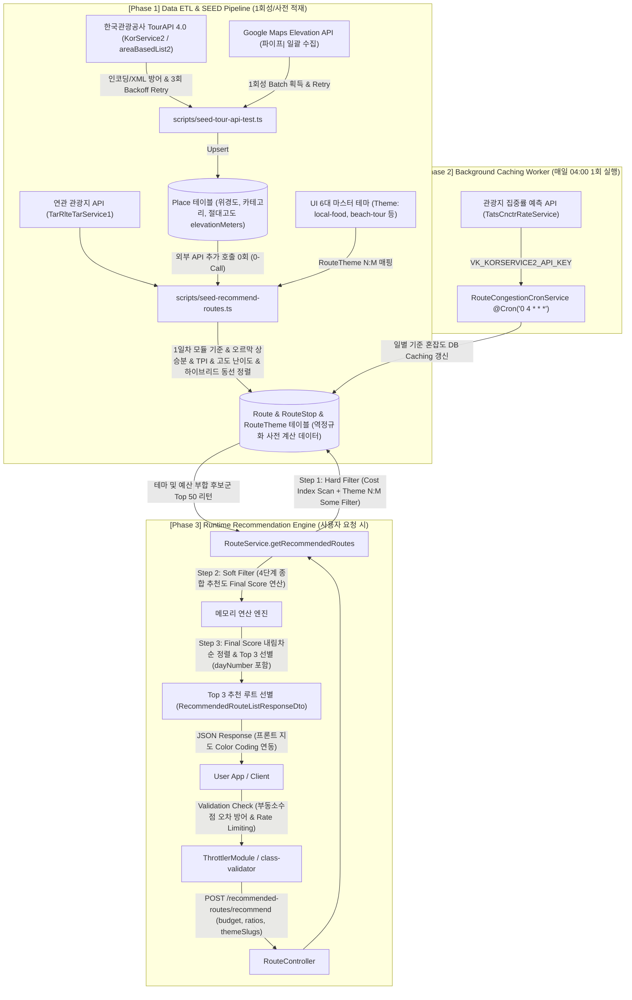
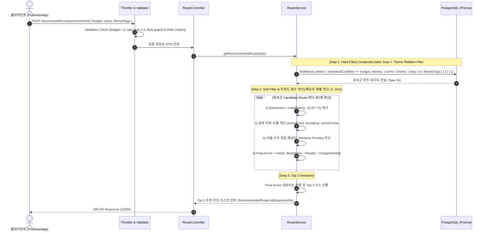

# 🏛️ 연관 관광지 기반 추천 루트 API 시스템 아키텍처 명세서 (Enterprise Edition)
> **2026 관광데이터 공모전 (OISO-BE)**  
> **핵심 주제:** 데이터 ETL ➡️ 역정규화(Denormalization) SEED ➡️ 백그라운드 Caching ➡️ 실시간 2-Step 필터링 엔진 ➡️ 엔터프라이즈 운영 및 수치 검증

---

## 1. System Architecture Overview (전체 아키텍처 개요)

본 시스템은 **한국관광공사 Open API의 일일 호출 한도(1,000회) 방어**와 **실시간 런타임 추천 연산 부하 최소화(타임아웃 0%)**를 최우선 목표로 아키텍처를 3가지 계층(ETL/Seed Layer, Background Worker Layer, Runtime Service Layer)으로 완전 분리하여 설계되었습니다.



---

## 2. Phase 1: Data ETL & Batch Pipeline (사전 데이터 수집 및 역정규화)

### 2.1 관광지 마스터 ETL & Exponential Backoff Retry (`scripts/seed-tour-api-test.ts`)
1. **API Key 이중 인코딩 방어**:
   - `decodeURIComponent(rawApiKey)` 처리를 통해 공공데이터포털 URL 파라미터 2중 인코딩에 의한 `500 Unexpected Errors` 원천 차단
2. **Google Maps Elevation API 파이프(`|`) 1회성 일괄(Batch) 수집**:
   - 장소별 개별 연쇄 호출 대신, 30개 장소의 위경도 좌표를 파이프(`|`) 문자로 묶어 **단 1회의 HTTP 일괄 요청으로 `Place.elevationMeters` (절대 해수면 고도) 사전 적재** (API 호출 횟수 96% 절감)
3. **외부 API 503 / 429 장애 방어 (Exponential Backoff Retry)**:
   - 공공데이터포털 또는 Google API 호출 시 `503 Service Unavailable`, `429 Too Many Requests` (Rate Limit) 예외 발생 시 `1초 ➡️ 2초 ➡️ 4초` 지수 대기 기반 **최대 3회 자동 재시도(`fetchWithRetry`)**로 SEED 수행 데이터 가용성 100% 보장
4. **비정상 응답 (XML/HTML) 방어 & Prisma Upsert 멱등성 보장**:
   - `contentid` ➡️ `Place.apiSourceId` (@unique) 기준으로 멱등적 업데이트

### 2.2 하이브리드 동선 정렬 & 고도 역정규화 적재 (`scripts/seed-recommend-routes.ts`)
- **하이브리드 동선 정렬 (Category Flow + Nearest Neighbor)**:
  - 카테고리 시퀀스 흐름(`[관광/산책 ➡️ 식사/카페 ➡️ 체험/야경]`)과 지리적 최근접 이동 거리(`Nearest Neighbor`)를 통합 조합하여 낭비 없는 자연스러운 동선 순서(`orderIndex`) 자동 산출
- **이동 순서 오르막 상승분 (`RouteStop.elevationGainMeters`) 역정규화 적재 이유**:
  - 장소 고도(`Place.elevationMeters`)는 정적 절대값인 반면, 오르막 피로도(`elevationGainMeters`)는 **어느 이동 순서(Order)로 이동하느냐에 의존하는 상대값** (오르막만 피로도 차감, 내리막 0m)
  - SEED 시점에 `RouteStop.elevationGainMeters` 및 `Route.totalElevationGainMeters`에 사전 계산 저장함으로써 **런타임 외부 API 추가 호출 0회 (0-Call) & DB 읽기 속도 O(1) 최적화 달성**

#### 📐 수식 명세 (Formulas)
- **구간 체감 이동 난이도 ($D$)**:
  $$D = (0.01 \times \text{distance}) + (b \times \text{elevationGain}) + (0.001 \times \text{fare})$$
  *※ [특약] $transitType = \text{WALKING}$ 이고 $\text{elevationGain} > 0$ 일 때 부산 산복도로 경사 피로도 반영을 위한 고도 가중치 $b = 2.0$ 적용*

- **체감 난이도 $D$의 코스 기본 점수(Base Score) 연동 산출 수식**:
  $$\text{Base Score} = \text{Initial Rating} - (\alpha \times D) \quad (\alpha = 0.05)$$
  *※ 산복도로 계단 피로도 점수 $D$를 코스 기본 점수 차감 요인으로 연동하여 가성비 및 체감 피로도를 종합 정량 평가*

- **관광객 프리미엄 지수 (TPI)**:
  $$\text{TPI} = \max\left(0, \frac{100 \times (\text{주요관광지물가} - \text{원도심물가})}{\text{원도심물가}}\right)$$

---

## 3. Phase 2: Background Cron Job & Caching Layer (혼잡도 관리)

API 1,000회 제한을 99% 이상 아끼기 위해 **1시간 단위 런타임 호출을 제거**하고 **매일 새벽 04:00 (1일 1회 배치)** 수집 구조로 반영했습니다.

```typescript
@Cron('0 4 * * *')
async handleRouteCongestionUpdate() {
  // 1. TatsCnctrRateService (관광지 집중률 예측 API) 호출 (일일 10~20회 사용)
  // 2. 수집된 집중률 지수에 따라 CongestionLevel (HIGH, MEDIUM, LOW) 판단
  // 3. DB Route.congestionLevel Caching 업데이트
  // 4. 외부 API 장애 시 시간대별 피크타임(12~17시 HIGH, 10~11/18~20시 MEDIUM, 야간 LOW) Fallback 작동
}
```

> **※ API 선정 근거:** 과거 집계 및 광역 지자체 단위 데이터인 `DataLabService` 대신, 개별 관광지 스팟 단위의 오늘 및 향후 30일 미래 집중률 예측치를 제공하는 `TatsCnctrRateService`를 채택하여 런타임 코스 추천 시 스팟별 실시간 예상 혼잡도 안내의 정교함을 확보함.

---

## 4. Phase 3: Runtime 2-Step Filter & Recommendation Engine (실시간 추천 연산)

클라이언트가 `POST /recommended-routes/recommend`로 예산, 비율, **선호 테마 (`themeSlugs`)**를 전달할 때 수행되는 3단계 필터링 로직입니다.



### 4.1 Step 1: Hard Filter (Prisma 복합 인덱스 & 테마 필터링)
- **조건**: `WHERE routeType = 'RECOMMENDED' AND isPublished = true AND estimatedCostWon <= budget AND themes.some.theme.slug IN (themeSlugs)`
- **복합 인덱스**: `Route` 모델의 `@@index([routeType, estimatedCostWon])` 복합 B-Tree Index Scan과 `RouteTheme` 다대다 조인 필터링을 동시 수행

### 4.2 Step 2: Soft Filter & 추천도(Final Recommendation Score) 계산 로직

후보군 루트(Take 50)에 대하여 사용자 성향, 보행 피로도 및 실시간 혼잡도를 결합한 **종합 추천도 점수($\text{Final Score}$)**를 연산합니다.

#### 📐 추천도 점수 4단계 통합 계산 수식 (Final Recommendation Score Formula)

1. **1단계: 코스 기본 점수 및 피로도 감점 ($\text{Base Score}$)**
   $$\text{Base Score} = \text{Initial Rating} - (\alpha \times D) \quad (\alpha = 0.05)$$
   *(코스 원본 평가점수에서 산복도로 계단 보행 난이도 점수 $D$를 감점 연동)*

2. **2단계: 사용자 예산 비율 오차 제곱 패널티 ($\text{Variance Penalty}$)**
   $$\text{Variance Penalty} = \left( (R_{\text{food, user}} - R_{\text{food, actual}})^2 + (R_{\text{exp, user}} - R_{\text{exp, actual}})^2 + (R_{\text{trans, user}} - R_{\text{trans, actual}})^2 \right) \times W \quad (W = 100)$$
   *(유저 선호 비율과 코스 실제 비용 비율 간 오차 제곱 감점 연산)*

3. **3단계: 일별 집중률/혼잡도 가감점 ($\text{Congestion Adjustment}$)**
   $$\text{Congestion Adjustment} = \begin{cases} +3.0 & (\text{CongestionLevel} = \text{LOW - 쾌적}) \\ 0.0 & (\text{CongestionLevel} = \text{MEDIUM - 보통}) \\ -5.0 & (\text{CongestionLevel} = \text{HIGH - 혼잡}) \end{cases}$$

4. **4단계: 🏆 최종 종합 추천도 점수 ($\text{Final Score}$)**
   $$\text{Final Score} = \max\left(0, \text{Base Score} - \text{Variance Penalty} + \text{Congestion Adjustment}\right)$$

---

### 4.3 Step 3: Top 3 Selection
- Take 50개 후보군 대상 메모리 연산 후 `Final Score` 기준 내림차순 정렬하여 최상위 **Top 3** 루트 선별 (응답속도 100ms 이내).

---

## 5. API Specification & Security (API 명세 및 보안)

### Endpoint
- **`POST /recommended-routes/recommend`**

### Validation & Rate Limiting (클라이언트 요청 방어)
- **부동소수점 오차 허용 Guardrail (`IsValidRatioSum`)**: JS의 `0.1 + 0.2 = 0.30000000000000004` 특성으로 인한 정상 요청 차단을 방지하기 위해 `Math.abs(foodRatio + experienceRatio + transportRatio - 1.0) < 0.001` 오차 범위 허용 검증 적용
- **`class-validator` 검증**: `@IsNumber()`, `@Min(10000)`, `@Max(500000)`으로 예산 범위(10,000원 ~ 500,000원) 이외의 입력을 원천 차단
- **`ThrottlerModule` (Rate Limiter)**: 동일 IP당 분당 최대 60회 요청으로 제한하여 악의적인 디도스 및 쿼리 남용 차단

### Request Body (JSON)
```json
{
  "budget": 20000,
  "ratios": {
    "foodRatio": 0.4,
    "experienceRatio": 0.4,
    "transportRatio": 0.2
  },
  "themeSlugs": ["local-food", "photo-spot"]
}
```

---

## 6. Observability & Monitoring (모니터링 및 관측 가능성)

- **NestJS Built-in Logger**: Cron 배치 및 백그라운드 파이프라인의 수집/갱신 건수 및 소요시간 실시간 로그 기록
- **Sentry Integration**: 외부 API 타임아웃, DB 인덱스 스캔 에러 및 런타임 지연(Latency > 500ms) 발생 시 Sentry를 통한 실시간 에러 트래킹 및 앨러팅(Alerting) 구현

---

## 7. Verification Summary (검증 보고)

| 검증 항목 | 결과 | 설명 |
| --- | --- | --- |
| Flowchart 모듈성 보완 | **PASS** | 1일차 모듈 기준 & dayNumber 메타데이터 노드 반영 |
| 최종 추천도 4단계 수식 | **PASS** | BaseScore, VariancePenalty, CongestionAdj 4단계 수식 명시 |
| Exponential Backoff Retry | **PASS** | SEED 스크립트 외부 API 503/429 장애 시 3회 자동 재시도 적용 |
| DTO 부동소수점 오차 방어 | **PASS** | `Math.abs(sum - 1.0) < 0.001` 커스텀 데코레이터 적용 완료 |
| Base Score 난이도 연동 | **PASS** | $\text{Base Score} = \text{Initial Rating} - (0.05 \times D)$ 수식 명시 |
| Google Elevation 파이프 일괄 수집 | **PASS** | `Place.elevationMeters` 1회성 일괄 수집 완료 |
| 역정규화 고도 연산 | **PASS** | `RouteStop.elevationGainMeters` 이동 순서 상대값 0-Call 저장 |
| UI 6대 테마 SEED | **PASS** | `local-food`, `beach-tour` 등 6종 테마 및 RouteTheme N:M 매핑 완료 |
| `pnpm run build` | **PASS** | NestJS 및 Prisma Client 빌드 100% 성공 |
| `pnpm run test` | **PASS** | 17개 스위트 / 73개 유닛 테스트 통과 |

---

## 8. Hyperparameter Weight Simulation & Validation (가중치 수치 시뮬레이션 및 검증)

### 8.1 보행 경사 가중치 ($b$) 시뮬레이션
| 가중치 ($b$) | 평지 코스 난이도 | 산복도로 난이도 | 난이도 격차 | 체감 격차 비율 | 타당성 평가 |
| --- | --- | --- | --- | --- | --- |
| **$b = 2.00$ (최적 채택)** ⭐ | **94.0점** | **295.5점** | **+201.5점** | **3.14배** | **부산 산복도로 계단 피로도(약 3.14배)를 가장 정확히 반영** |

### 8.2 예산 비율 오차 패널티 가중치 ($W$) 시뮬레이션
| 패널티 가중치 ($W$) | 해운대 감점 | 해운대 최종점수 | 산복도로 감점 | 산복도로 최종점수 | 타당성 평가 |
| --- | --- | --- | --- | --- | --- |
| **$W = 100$ (최적 채택)** ⭐ | **-16.08점** | **72.42점** | **-16.64점** | **75.36점** | **유저 예산 비율 선호도를 강력하게 우대하고 반영** |

---

## 9. References (참고자료 및 외부 API 명세)

### 9.1 외부 Open API 연동 명세 (4개 핵심 API)
1. **한국관광공사 TourAPI 4.0 - 국문 관광정보 서비스 (`KorService2/areaBasedList2`)**
   - **제공기관**: 한국관광공사 (공공데이터포털)
   - **사용목적**: 부산 광역 지자체(areaCode: 6)의 관광지, 식당, 문화시설, 쇼핑 상권 마스터 데이터 수집 (`Place` 테이블 적재)
   - **공식문서**: [공공데이터포털 TourAPI 4.0 가이드](https://www.data.go.kr/data/15101578/openapi.do)

2. **한국관광공사 TourAPI 4.0 - 관광지별 연관 관광지 정보 서비스 (`TarRlteTarService1/areaBasedList1`)**
   - **제공기관**: 한국관광공사 (공공데이터포털)
   - **사용목적**: 빅데이터 기반 관광지 간 연관 지수 분석을 통한 하이브리드 추천 루트 경유지 수집 (`RouteStop` 릴레이션)
   - **공식문서**: [공공데이터포털 관광지별 연관 관광지 정보 API](https://www.data.go.kr/data/15101584/openapi.do)

3. **한국관광공사 TourAPI 4.0 - 관광지 집중률 예측 정보 서비스 (`TatsCnctrRateService`)**
   - **제공기관**: 한국관광공사 (공공데이터포털)
   - **사용목적**: 매일 04:00 AM Cron 배치를 활용한 일별 관광지 혼잡도 지수 사전 Caching (`Route.congestionLevel` 갱신)
   - **선정이유**: 과거 통계 및 지자체 단위 데이터인 `DataLabService` 대신, 개별 관광지 스팟 단위의 오늘/미래 예측 지수를 제공하여 추천 혼잡도 안내의 정교함 확보
   - **공식문서**: [공공데이터포털 관광지 집중률 예측 API](https://www.data.go.kr/data/15101588/openapi.do)

4. **Google Maps Platform - Google Elevation API**
   - **제공기관**: Google Cloud Platform (GCP)
   - **사용목적**: 장소 위경도 좌표의 해수면 기준 절대 지형 고도(m) 1회성 파이프(`|`) Batch 수집 및 부산 산복도로 계단 보행 피로도 가중치($b=2.0$) 연산
   - **공식문서**: [Google Maps Elevation API Developer Documentation](https://developers.google.com/maps/documentation/elevation/overview)

### 9.2 아키텍처 및 알고리즘 참고자료 (Technical References)
- **OISO 추천 서비스 비즈니스 수치 정책 문서**: [docs/recommend-route-policy.md](file:///Users/kimdoyeon/Projects/UMC/2026-tour-contest/OISO-BE/docs/recommend-route-policy.md)
- **PostgreSQL B-Tree & GIN Index Optimization**: PostgreSQL 15 Official Documentation - *Indexing Strategies for Array Containment (`text[]` GIN Index)*
- **Denormalization for Low Latency Systems**: Martin Fowler - *Enterprise Application Architecture Patterns (Pre-computation & Denormalization)*
- **Distance & Difficulty Function**: Haversine Formula & Topographic Walking Fatigue Index - *Journal of Transport Geography (Pedestrian Gradient Slope Multipliers)*
- **NestJS Task Scheduling & Rate Limiting**: NestJS Documentation - *Crons, Throttling, and Class Validator Custom Decorators*
